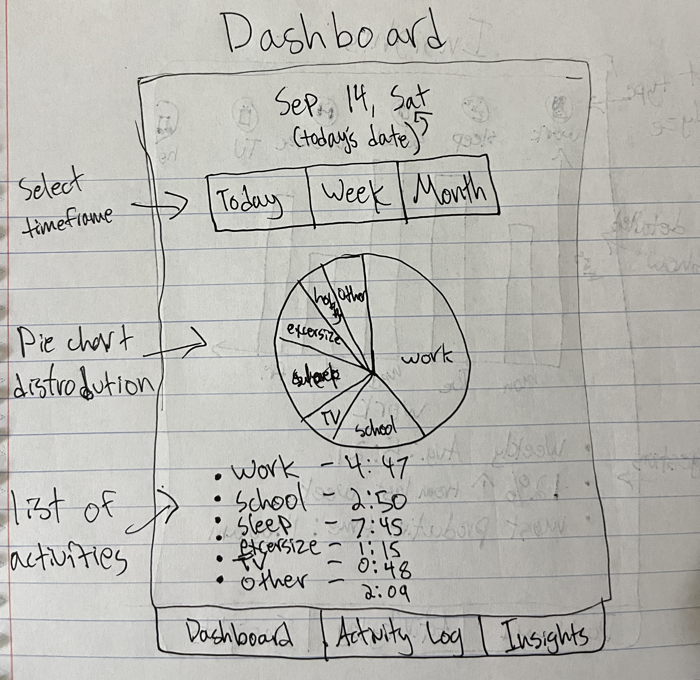
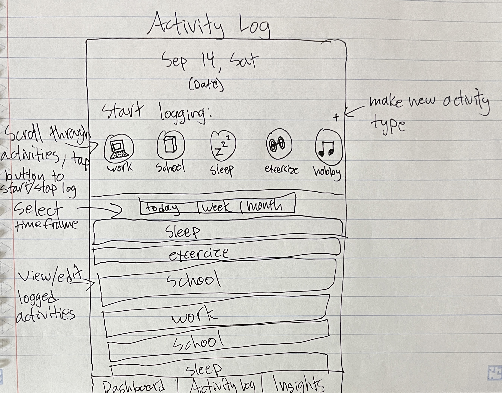
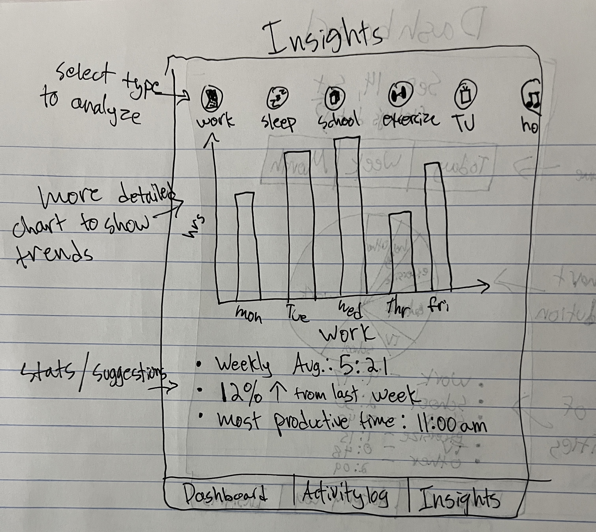

# Startup

# TimeTracker

## Elevator Pitch
Ever wondered how you’re spending your time each day? TimeTracker is a personal time-tracking app that not only helps you log your activities but also provides insightful analytics to elevate how you manage your time. With personalized insights, and engaging visualizations, this app helps you identify exactly how your time is allocated and make adjustments to improve productivity and find balance.

## Design
Below are rough sketches of the application's user interface:

1. **Dashboard**
   - Overview of daily/weekly/monthly time distribution.
   - Graphs and charts for activity analysis.

2. **Activity Log**
   - Section for manual time entry and editing.
   - Real-time updates for tracked activities.

3. **Insights Page**
   - Detailed analytics and user-specific recommendations.

## Key Features
- **Customizable Analytics Dashboard**: Visualize time spent on various activities with customizable and interactive charts and graphs.
- **Personalized Insights and Recommendations**: Receive tailored suggestions to improve time management based on tracked data.
- **Seamless Integration**: Sync with calendars and productivity tools for comprehensive tracking.
- **Secure Authentication**: Safe and secure login with user account management.
- **Simple User Inputs**: Log activities and track time effortlessly with simple, one-click buttons.

## Other Possible Features
- **Automated Activity Tracking**: Automatically log activities based on location, device usage, or wearables.
- **Gamification**: Earn rewards and participate in challenges to stay motivated.

## Technologies
### HTML ✅
- **HTML Pages**: I added 4 html pages, one for login, dashboard, activity log, and insights. (once I have the login implementation for authenticating users, I will have the login index.html page automatically link to the dashboard)
- **Links**: Added links at the top to nagigate between the different pages.
- **Login/DB Placeholder**: Index page is a login with an input box and login button, will then pull the user's data from database.
- **Websocket/Charts Placeholder**: The user's individualized data and info will automatically update the charts and visualizations in the dashboard, activity log, and insights page in real time.
- **App Text/Content**: Text on the dashboard, activity log, and insights page to describe the activities and their data from the websocket and database. Buttons to log each of the specified activites, including creating a new activity to be tracked. 
- **Third-Party Service/API Calls**: API calls will be used for user authentication, and fetching user specific data from other apps like google calendar.

### CSS ✅
- **Header, Footer**: Implemented a clean design for the header and footer that remains consistent across all pages of the app.
- **Main Content Body**: Stylized each page individually with how the final version of the app will look.
- **Navigation Elements**: I added buttons with mouse hover implementation. The navigation menu also appears the same across all pages of the app, but the page currenly being viewed is highlighted in the menu.
- **Responsive to Window Resizing**: Added flex functionality so the elements of each page resize to look clean across any size of browser window.
- **Application Elements**: Elements are neatly spaced across the pages of the app with effective use of whitespace to clearly organize all application elements.
- **Application Text Content**: Text fonts are the same, and each page has a consistent color and spacing theme.
- **Application Images**: Clock icon at the top of each page to appear as a logo. The pie chart image on the dashboard page has flex resizing functionality so it stays centered and fits in any size window.

### React ✅
- **Bundled/Transpiled**: Bundled using Vite.
- **React Components**: Added components for login, dashboard, activity log, and insights.
   - **Login**: Handles use login functionality.
   - **Dashboard**: Displays user activity and time tracking data.
   - **Activity Log**: Shows a detailed log of user activities.
   - **Insights**: Provides detailed visual insights into time spent.
- **Routing**: I implemented react router to manage navigation between different pages of the app.
- **Hooks**: I used hooks like useState and useEffect to manage state and side effects within components.

### Service
- **Backend Service**: Endpoints for:
  - **Login**: Registering, logging in, and managing user accounts.
  - **Activity Data**: Storing and retrieving time logs and activity details.
  - **Analytics**: Analytics data for visualization.
  - **Third-Party API**: Integration with an external API for additional data, such as location-based information.

### Authentication
- **Login/Signup**: Secure login system allowing users to create accounts and manage their profiles.

### Database
- **Persistent Storage**: Store user data, activity logs, and analytics in a database. Support for user authentication and activity tracking.

### WebSocket
- **Real-Time Updates**: Use WebSockets to provide real-time updates for activity logs and analytics, ensuring users see live data changes.